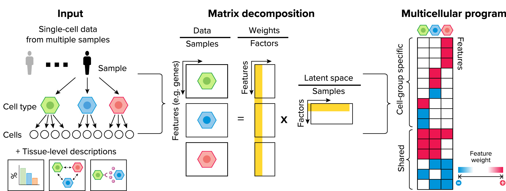
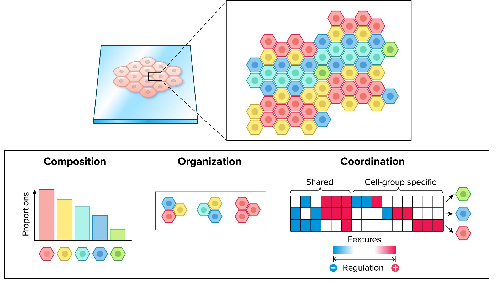
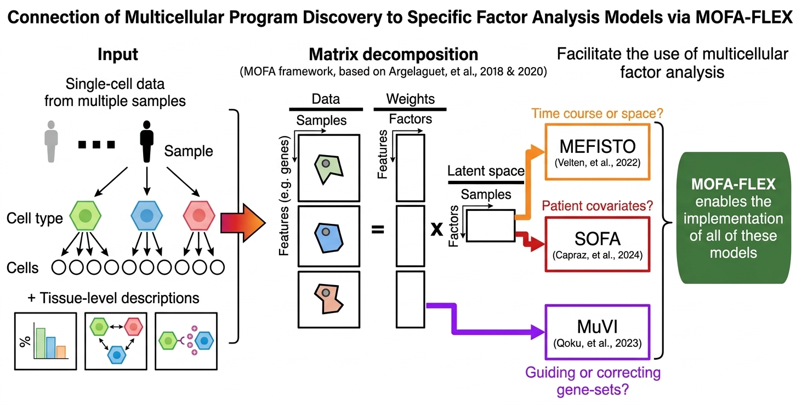

# MINA

## Multicellular INtegration Analysis

`mina` provides a bridge between single-cell analysis workflows from `scverse`,
factor-based models from `MOFA-FLEX`, and prior knowledge to generate tissue-centric
descriptions from single-cell data.

The package supports preprocessing, multi-view construction, visualization,
and downstream interpretation of multicellular programs.

## Installation

MINA currently targets Python 3.12 and 3.13.
MINA currently targets `mofaflex==0.1.0.post1`.

Install the latest development version with:

```bash
pip install git+https://github.com/saezlab/MINA.git@main
```

### Patient-level representations of tissue state

Current molecular measurements are typically acquired at the level of genes and cells, but the biological and clinical question is defined at the level of the **patient** or **tissues**. A central challenge is therefore to construct representations that summarize how a tissue is organized and perturbed in each individual, while remaining comparable across cohorts and technologies.

A useful abstraction is to represent each patient as a point in a space of **tissue states**, where variation reflects coordinated biological processes rather than isolated features. This requires moving beyond single-cell resolution alone and explicitly modeling how signals are structured across cell types within a tissue.

---

### Multicellular programs as an initial formulation

An initial step in this direction is the definition of **multicellular programs**: latent variables capturing coordinated gene expression changes across multiple cell types.

These programs:

- Encode **coupled responses across cell types**, rather than independent effects  
- Provide a **low-dimensional representation** of patient variability  
- Are **robust to differences in cell-type composition and technical noise**  
- Enable alignment of **bulk and single-cell data** within a shared space  

This formulation shifts the focus from *which genes change in which cells* to *which coordinated processes define the tissue state of a patient*.

<p align="center">
  
</p>

<p align="center"><em>Reconstruction of multicellular programs from single-cell data. Adapted from Ramirez Flores, et al. 2024. Physiology</em></p>

---

### Generalization to tissue descriptor modeling

Multicellular programs are one instance of a broader concept: **tissue descriptors**. These are quantitative summaries of different aspects of tissue organization that can be defined per patient.

Relevant descriptors include:

- **Gene expression per cell type**  
- **Cell-type composition**  
- **Cell–cell communication patterns** (e.g. ligand–receptor activity)  
- **Pathway or regulatory activities**  

Each descriptor captures a different facet of tissue biology. The key objective is not to analyze them in isolation, but to model their **joint variation at the patient level**.

Within this perspective, multicellular programs act as a **latent representation that integrates across descriptors**, rather than a standalone endpoint. They provide a scaffold to understand how different aspects of tissue organization co-vary.

<p align="center">
  
</p>

<p align="center"><em>Reconstruction of multicellular programs from single-cell data. Adapted from Ramirez Flores, et al. 2024. Physiology</em></p>

---

### Why factor models

Factor models provide a natural framework for this problem because they are designed to capture shared structure across heterogeneous, high-dimensional data.

In this context:

- Each tissue descriptor (e.g. expression in a cell type, communication scores) is treated as a **view**  
- The model learns a set of **latent factors** that explain covariance across these views  
- These factors represent **tissue-level axes of variation**, i.e. patient-level states  

This enables:

- **Integration of multiple descriptors** within a single model  
- Separation of **shared biological variation** from descriptor-specific effects  
- **Dimensionality reduction with interpretability**, via factor loadings  
- Projection of new samples into the learned latent space 

### Conceptual summary

The framework can be summarized as a progression:

1. **Patient representation problem**: define comparable, interpreable summaries of tissue state  
2. **Multicellular programs**: capture coordinated gene expression across cell types  
3. **Tissue descriptors**: generalize to multiple complementary views of tissue organization  
4. **Factor models**: provide the statistical machinery to integrate these views into coherent patient-level representations  

This positions patient heterogeneity as variation along **latent axes of multicellular organization**, rather than as independent changes in genes or cell types.

### What's new?

MINA is a python package that expands the functionalities provided in our [R implementation](https://github.com/saezlab/MOFAcellulaR) and in [LIANA+](https://liana-py.readthedocs.io/en/latest/notebooks/mofacellular.html).

MINA simplifies the pre-processing of single cell data, connects to new models available in [MOFA-FLEX](https://github.com/bioFAM/mofaflex), and enables new downstream analyses.

Particularly it enables the guidance of factors using information of samples and features as presented in other factor models.

<p align="center">
  
</p>

<p align="center"><em>Reconstruction of multicellular programs from single-cell data. Adapted from Ramirez Flores, et al. 2024. Physiology</em></p>

---

## Documentation Map

- Start with the [collection of vignettes](tutorials.md) that explain the basics of multicellular factor analysis.
- Explore the [API reference](api/index.md).
- See [contributing](contributing.md) for local development and docs builds.

## Citation

> Ricardo Omar Ramirez Flores, Jan David Lanzer, Daniel Dimitrov, Britta Velten,
> Julio Saez-Rodriguez (2023) Multicellular factor analysis of single-cell data
> for a tissue-centric understanding of disease. eLife 12:e93161.
